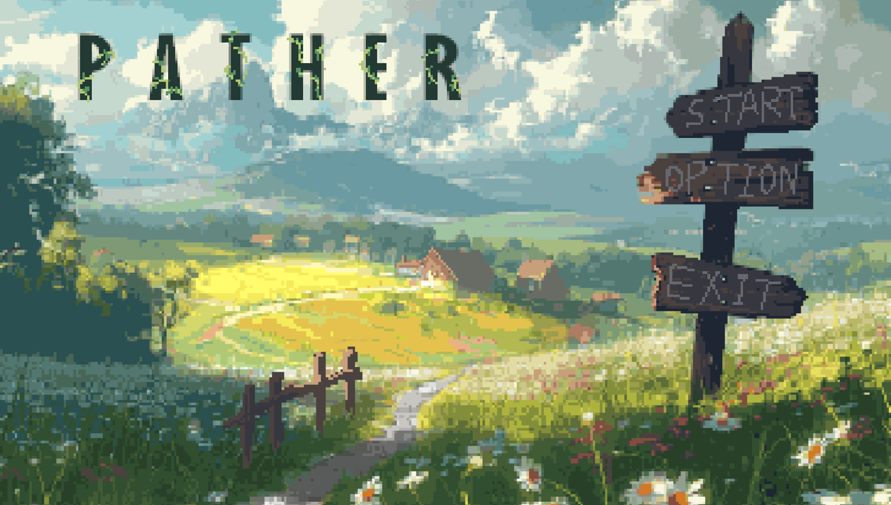
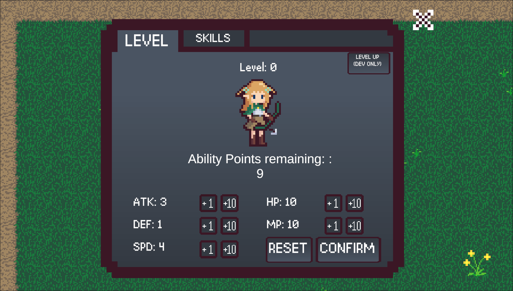
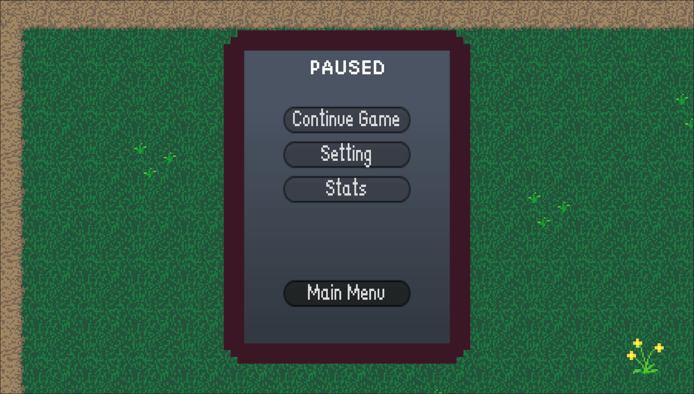
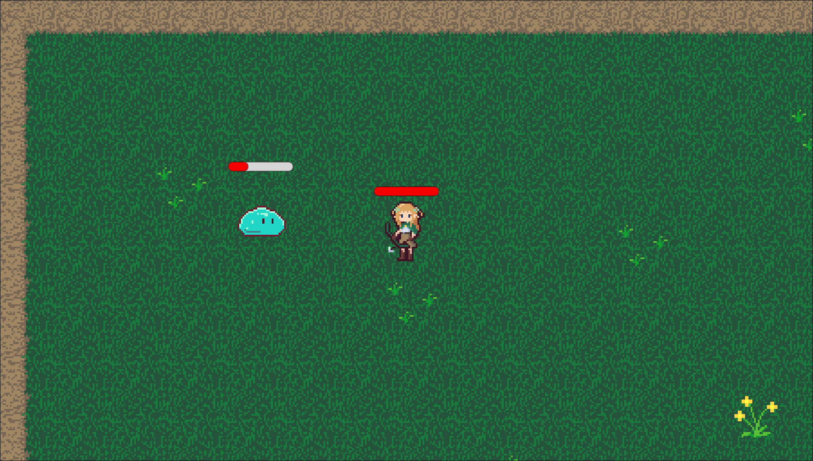
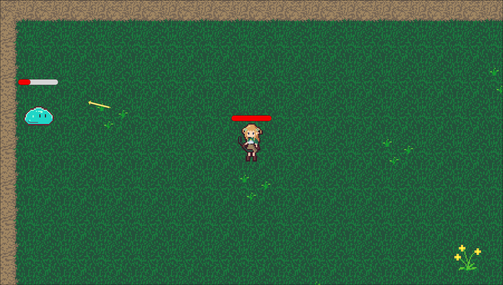

# Project PathER

Project PathER is a 2D roguelike RPG where players embark on an exciting adventure, battling enemies, leveling up their characters, and exploring vibrant pixel-art environments. This project is a personal endeavor to combine captivating gameplay mechanics with retro-inspired art.

## Features
- **Dynamic Leveling System**: Customize your character's stats with ability points.
- **Combat**: Engage in fast-paced battles against enemies with real-time visual feedback.
- **Pixel-Art Design**: Enjoy a colorful, nostalgic visual experience.
- **Roguelike Elements**: Experience procedurally generated content and challenging gameplay.

## Gameplay Screenshots

### Title Screen


### Menus



### Combat



## Getting Started

### Prerequisites
- A computer with [Unity](https://unity.com/) installed.
- Basic knowledge of running Unity projects.

### Installation
1. Clone the repository:
   ```bash
   git clone https://github.com/Snowey1110/ProjectPathER.git
   
